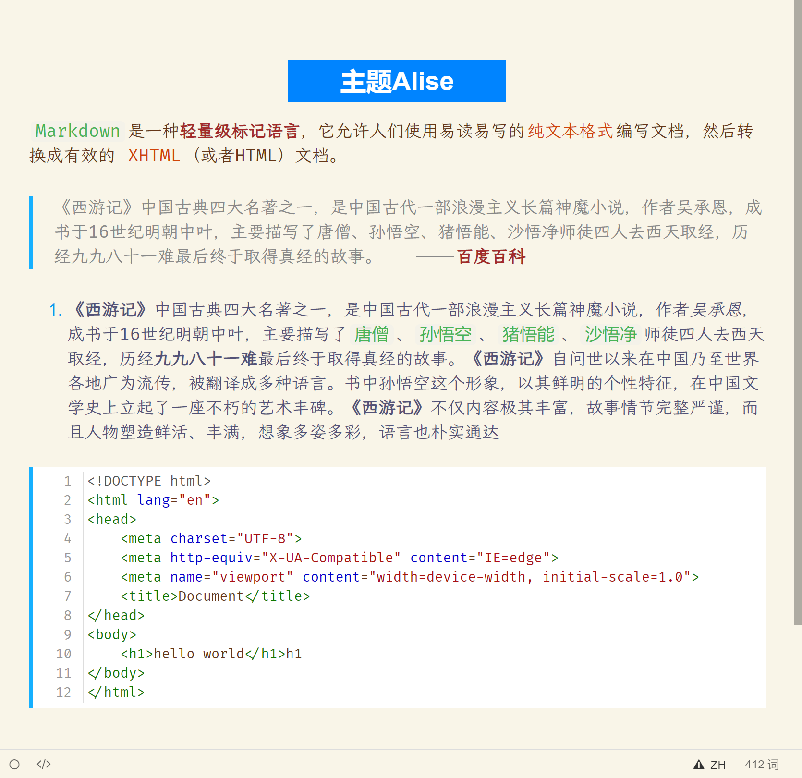

## 简介

`Alise`是一款美观，易用的`markdown`主题

## 使用指南

1. 右键打开`git bush`,`clone`本仓库
2. 打开typora主题路径，一般是`C:\Users\[username]\AppData\Roaming\Typora\themes`,也可以在typora设置页面打开。
3. 把仓库中`assets`文件夹中内容复制到typora主题文件夹
4. 在typora设置中切换主题为`alise`
5. enjoy it:heart:

## 反馈bug

请在GitHub提交issues